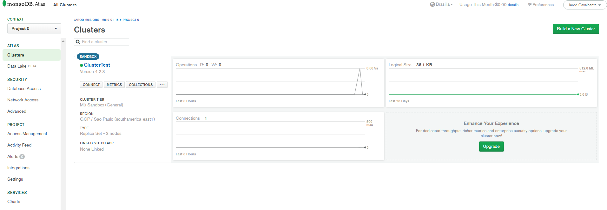
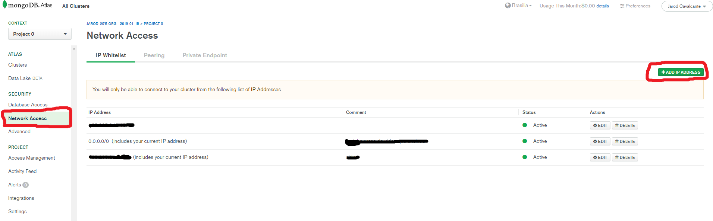
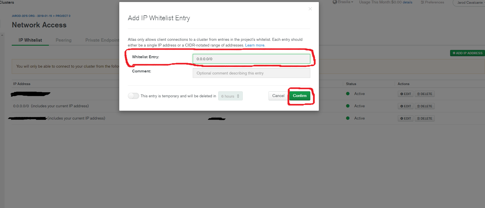
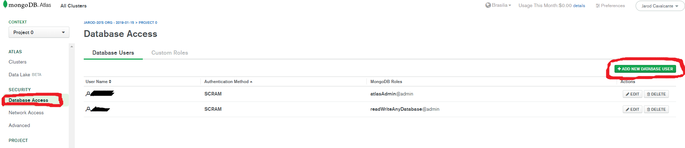
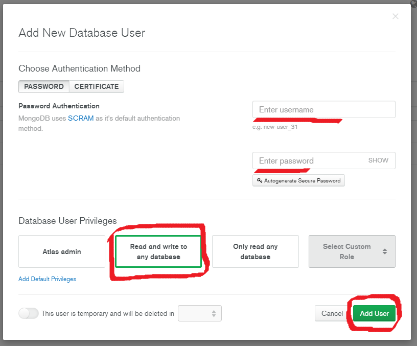
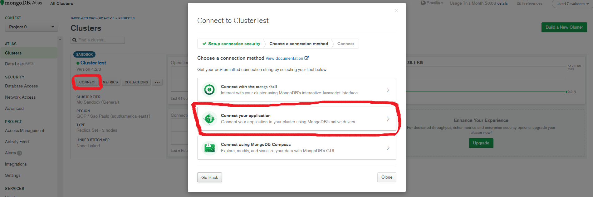
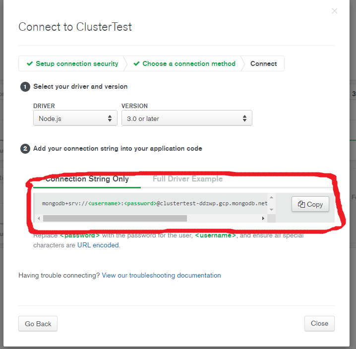

# Conectar NodeJS no Mongo Atlas/Cloud.mongodb

Estou fazendo esse "tutorial" com base em uma grande luta e pesquisa onde me vi perdido ao tentar conectar meu NodeJs ao Mongo Atlas. Sim, há muitos vídeos no youtube ensinando a fazer isso, porém a grande maioria é de 2018 e bem no início de 2019, e de lá pra ca o Mongo Atlas mudou bastante, inclusive sua forma de conexão.

## A baixo, segue os passos com imagens e explicação para efetuar a configuração no mongo atlas/cloud.

> ***Mas, primeiro preciso que você possua uma conta no mongo atlas, claro. Irei levar em consideração que você já possua a conta, um cluster e um banco de dados juntamente com uma collection dentro do mesmo. Tudo isso citado anteriormente é bem fácil de fazer, caso não possua uma conta no MongoAtlas, clique [aqui](https://www.mongodb.com/cloud/atlas/lp/general/try?utm_source=google&utm_campaign=gs_americas_brazil_search_brand_atlas_desktop&utm_term=mongo%20atlas&utm_medium=cpc_paid_search&utm_ad=e&gclid=EAIaIQobChMIjZjZwYKY6AIVC4iRCh0J3w7aEAAYASAAEgImQ_D_BwE). para acessar a página de login/registro***

## Passos para a conexão

1. Acesse seu Mongo Atlas e seu Cluster onde há seu/seus banco de dados que deseja conectar

2. À esquerda, acesse a aba _Network Access_ 
- Essa aba é onde você colocara o seu endereço de IP e o endereço _0.0.0.0/0_ para poder acessar o mongo atlas do seu pc e sua API(nodejs)

3. Selecione a opção _ADD IP ADDRESS_
- Adicione o seu endereço de ip e salve, volter novamente e adicione o endereço _0.0.0.0/0_

4. Agora, também à esquerda, acesse a aba _Database Access_
- Nessa aba, você irá criar um novo usuário, além do adminitrador padrão (que é você acessando diretamente pelo site). O novo usuário não precisa ter as permissões de administrador, apenas a de um crud básico.

5. Seleciona a opção _ADD NEW DATABASE USER_
- Preencha os campos de usuário e senha (fica à sua vontade). Depois selecione a opção logo abaixo _Read and write to any database_. Salve.

6. Depois você pode acessar seu cluster normalmente (pelo compass também)
- Apenas pelo uri de conexão. Segue duas imagens abaixo de como pegar sua uri para conexão.
- Você deve alterar os campos _<username>_ e _<password>_ por seu usuário e senha respectivamente. (pode ser o usuário que você acabou de criar ou seu usuário padrão que acessa o mongo atlas (no caso, administrador))

